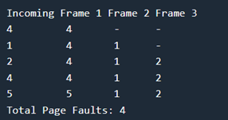
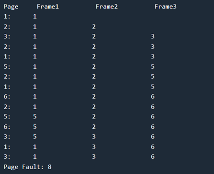

# OS-EX.10-IMPLEMENTATION-OF-PAGE-REPLACEMENT-ALGORITHMS

(Follow template provided in CPU Scheduling algorithms for sub divisions)
## FIFO Page Replacement Algorithm
## AIM:
To implement FIFO page replacement algorithm in C .
## ALGORITHM:
Step 1: Initialize arrays and variables, including the incoming page stream, page faults counter, number of frames, and loop counters.

Step 2: Calculate the total number of pages in the incoming stream.

Step 3: Initialize an array representing frames, set them to -1 (empty), and loop through the incoming pages.

Step 4: For each page, check if it's already in the frames, manage page faults, and update the frames accordingly.

Step 5: After processing all pages, print the total number of page faults to demonstrate the working of the Least Recently Used (LRU) page replacement algorithm.

## PROGRAM:
```
#include<stdio.h> 
int main()
{
    int incomingStream[] = {4, 1, 2, 4, 5};
    int pageFaults = 0;
    int frames = 3;
    int m, n, s, pages;
    pages = sizeof(incomingStream)/sizeof(incomingStream[0]);
    printf("Incoming \t Frame 1 \t Frame 2 \t Frame 3");
    int temp[frames];
    for(m = 0; m < frames; m++)
    {
        temp[m] = -1;
    }
    for(m = 0; m < pages; m++)
    {
        s = 0;

        for(n = 0; n < frames; n++)
        {
            if(incomingStream[m] == temp[n])
            {
                s++;
                pageFaults--;
            }
        }
        pageFaults++;
        
        if((pageFaults <= frames) && (s == 0))
        {
            temp[m] = incomingStream[m];
        }
        else if(s == 0)
        {
            temp[(pageFaults - 1) % frames] = incomingStream[m];
        }
        printf("\n");
        printf("%d\t\t\t",incomingStream[m]);
        for(n = 0; n < frames; n++)
        {
            if(temp[n] != -1)
                printf(" %d\t\t\t", temp[n]);
            else
                printf(" - \t\t\t");
        }
    }
    printf("\nTotal Page Faults:\t%d\n", pageFaults);
    return 0;
}
```

## OUTPUT:


## RESULT:
Thus the implementation of FIFO page replacement algorithm in C is done successfully.
## Optimal Page Replacement
## AIM:
To implement Optimal page replacement algorithm in C .
## ALGORITHM:
Step 1: Initialize functions for checking page presence in frames and predicting optimal replacements based on future references.

Step 2: Define the main function optimalPage that simulates the Optimal Page Replacement Algorithm, handling hits and misses in a paging system.

Step 3: In the simulation, iterate through the reference string, checking if the current page is already in the frames (HIT) and updating frames accordingly.

Step 4: If the page is not in the frames (MISS), either place it in an empty frame if available or predict the best frame to replace based on future references using the predict function.

Step 5: After processing all pages, print the number of hits and misses, demonstrating how the Optimal Page Replacement Algorithm manages page faults in a system.
## PROGRAM:
```
#include <stdio.h>
// This function checks if current strea item(key) exists in any of the frames or not
int search(int key, int frame_items[], int frame_occupied)
{
    for (int i = 0; i < frame_occupied; i++)
        if (frame_items[i] == key)
            return 1;
    return 0;
}
void printOuterStructure(int max_frames){
    printf("Stream ");
    
    for(int i = 0; i < max_frames; i++)
        printf("Frame%d ", i+1);
}
void printCurrFrames(int item, int frame_items[], int frame_occupied, int max_frames){\ 
    // print current reference stream item
    printf("\n%d \t\t", item); 
    // print frame occupants one by one
    for(int i = 0; i < max_frames; i++){
        if(i < frame_occupied)
            printf("%d \t\t", frame_items[i]);
        else
            printf("- \t\t");
    }
}
// This Function helps in finding frame that will not be used
// for the longest period of time in future in ref_str[0 ... refStrLen - 1]
int predict(int ref_str[], int frame_items[], int refStrLen, int index, int frame_occupied)
{
    // For each current occupant in frame item
    // we try to find the frame item that will not be referenced in 
    // for the longest in future in the upcoming reference string
    int result = -1, farthest = index;
    for (int i = 0; i < frame_occupied; i++) {
        int j;
        for (j = index; j < refStrLen; j++) 
        { 
            if (frame_items[i] == ref_str[j]) 
            { 
                if (j > farthest) {
                    farthest = j;
                    result = i;
                }
                break;
            }
        } 
        // If we find a page that is never referenced in future,
        // return it immediately as its the best
        if (j == refStrLen)
            return i;
    } 
    // If none of the frame items appear in reference string
    // in the future then we return 0th index. Otherwise we return result
    return (result == -1) ? 0 : result;
} 
void optimalPage(int ref_str[], int refStrLen, int frame_items[], int max_frames)
{
    // initially none of the frames are occupied
    int frame_occupied = 0;
    printOuterStructure(max_frames); 
    // Here we traverse through reference string
    // and check for miss and hit.
    int hits = 0;
    for (int i = 0; i < refStrLen; i++) { 
        // If found already in the frame items : HIT
        if (search(ref_str[i], frame_items, frame_occupied)) {
            hits++;
            printCurrFrames(ref_str[i], frame_items, frame_occupied, max_frames);
            continue;
        } 
        if (frame_occupied < max_frames){
            frame_items[frame_occupied] = ref_str[i];
            frame_occupied++;
            printCurrFrames(ref_str[i], frame_items, frame_occupied, max_frames);
        }
        else {
            int pos = predict(ref_str, frame_items, refStrLen, i + 1, frame_occupied);
            frame_items[pos] = ref_str[i];
            printCurrFrames(ref_str[i], frame_items, frame_occupied, max_frames);
        } 
    }
    printf("\n\nHits: %d\n", hits);
    printf("Misses: %d", refStrLen - hits);
}
  
// Driver Function
int main()
{
    // int ref_str[] = {9, 0, 5, 1, 0, 3, 0, 4, 1, 3, 0, 3, 1, 3};
    int ref_str[] = {7, 0, 1, 2, 0, 3, 0, 4, 2, 3, 0, 3, 2, 1, 2, 0, 1, 7, 0, 1};
    int refStrLen = sizeof(ref_str) / sizeof(ref_str[0]);
    int max_frames = 3;
    int frame_items[max_frames];
    
    optimalPage(ref_str, refStrLen, frame_items, max_frames);
    return 0;
}
```
## OUTPUT:

## RESULT:
Thus the implementation of Optimal page replacement algorithm in C is done successfully.
## Least Recently Used
## AIM :
To implement LRU page replacement algorithm in C .
## ALGORITHM:
Step 1: Initialize variables, arrays, and a function for checking page presence in frames.

Step 2: Define the main function to simulate the LRU (Least Recently Used) page replacement algorithm, including the incoming page stream, frames, distances, occupied frames, and page fault count.

Step 3: Iterate through the incoming page stream and, for each page, check if it's already in the frames (HIT) and handle cases of empty frames or page replacement for MISS.

Step 4: For MISS cases, calculate distances of the currently occupied frames from their last occurrence and select the frame with the maximum distance as the LRU candidate for replacement.

Step 5: After processing all pages, print the page faults count to demonstrate how the LRU page replacement algorithm manages page faults by replacing the least recently used pages when necessary.
## PROGRAM:
```
#include<stdio.h>
#include<limits.h>
int checkHit(int incomingPage, int queue[], int occupied){ 
    for(int i = 0; i < occupied; i++){
        if(incomingPage == queue[i])
            return 1;
    } 
    return 0;
}
void printFrame(int queue[], int occupied)
{
    for(int i = 0; i < occupied; i++)
        printf("%d\t\t\t",queue[i]);
}
int main()
{
//    int incomingStream[] = {7, 0, 1, 2, 0, 3, 0, 4, 2, 3, 0, 3, 2, 1};
//    int incomingStream[] = {1, 2, 3, 2, 1, 5, 2, 1, 6, 2, 5, 6, 3, 1, 3, 6, 1, 2, 4, 3};
    int incomingStream[] = {1, 2, 3, 2, 1, 5, 2, 1, 6, 2, 5, 6, 3, 1, 3};
    int n = sizeof(incomingStream)/sizeof(incomingStream[0]);
    int frames = 3;
    int queue[n];
    int distance[n];
    int occupied = 0;
    int pagefault = 0; 
    printf("Page\t Frame1 \t Frame2 \t Frame3\n"); 
    for(int i = 0;i < n; i++)
    {
        printf("%d:  \t\t",incomingStream[i]);
        if(checkHit(incomingStream[i], queue, occupied)){
            printFrame(queue, occupied);
        }
        else if(occupied < frames){
            queue[occupied] = incomingStream[i];
            pagefault++;
            occupied++; 
            printFrame(queue, occupied);
        }
        else{ 
            int max = INT_MIN;
            int index;
            // get LRU distance for each item in frame
            for (int j = 0; j < frames; j++)
            {
                distance[j] = 0;
                // traverse in reverse direction to find 
                // at what distance  frame item occurred last 
                for(int k = i - 1; k >= 0; k--)
                {
                    ++distance[j];

                    if(queue[j] == incomingStream[k])
                        break;
                } 
                if(distance[j] > max){
                    max = distance[j];
                    index = j;
                }
            }
            queue[index] = incomingStream[i];
            printFrame(queue, occupied);
            pagefault++;
        } 
        printf("\n");
    } 
    printf("Page Fault: %d",pagefault); 
    return 0;
}
```
## OUTPUT:

 ## RESULT:
Thus the implementation of LRU page replacement algorithm in C is done successfully.
